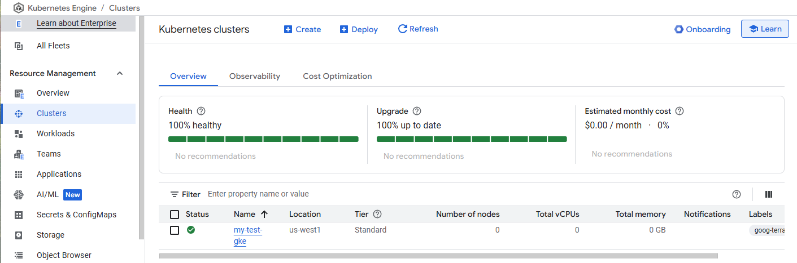
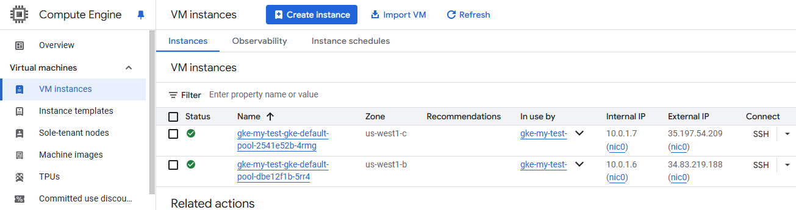
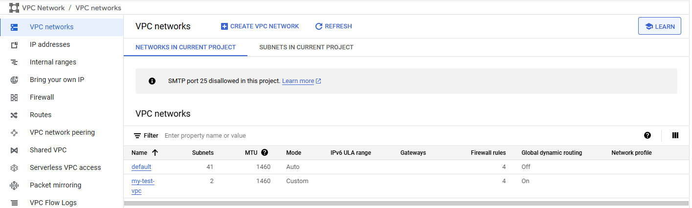
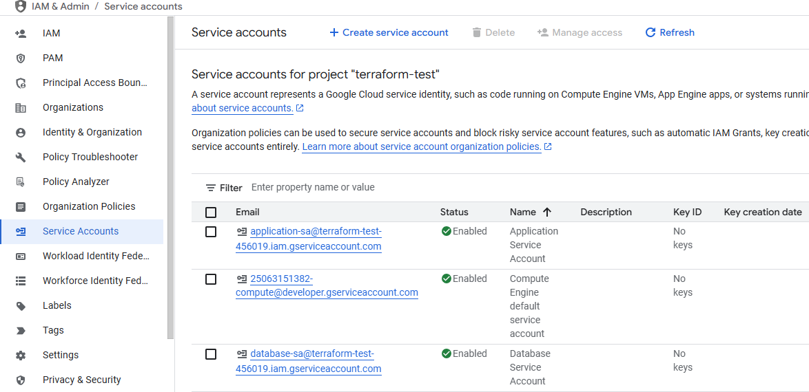

## Overview
This Terraform project provisions a minimum viable GCP environment that includes:
- A custom VPC with configurable CIDR and subnets.
- Service accounts.
- A GKE cluster with configurable node pools and autoscaling.

The configuration follows GCP best practices for security and networking, and the modules are designed to be reusable.

## Prerequisites
- Install Terraform on local machine
- Create GCP account or use with existing account
  - Enable following APIs:
    - Compute Engine API
    - Kubernetes Engine API
    - IAM API
- Verify GCP SDK and authenticate to login:
  ```bash
  gcloud version
  gcloud auth application-default login
## Create a terraform.tfvars
- Use a terraform.tfvars to apply your custom configuration to the Terraform setup template, e.g. following is my setup for testing
  ```terraform
  project        = "terraform-test-456019"
  region         = "us-west1"
  network_name   = "my-test-vpc"

  subnets = {
    "subnet-a" = { cidr = "10.0.1.0/24" },
    "subnet-b" = { cidr = "10.0.2.0/24" }
  }

  service_accounts = {
    "application-sa" = { display_name = "Application Service Account" },
    "database-sa"  = { display_name = "Database Service Account" }
  }

  cluster_name = "my-test-gke"

  node_pools = [
    {
      name         = "default-pool"
      machine_type = "e2-medium"
      min_count    = 1
      max_count    = 3
    }
  ]
- Terraform Best Practices
  - Custom VPC & explicit subnet definition
  - Split module design for reusability
  - Custom service account to avoid using default service account
  - Remove default GKE nodepool forcing define custom node pool

## Testing & Validation
- Run terraform init
  ```bash
  terraform init
- Run terraform validate & plan
  ```bash
  terraform validate
  terraform plan
- Execute to apply the change
  ```bash
  terraform apply
- Clean up after the testing
  ```bash
  terraform destroy

## Testing Results
- GKE Cluster

- Compute 

- Network

- Service Account

